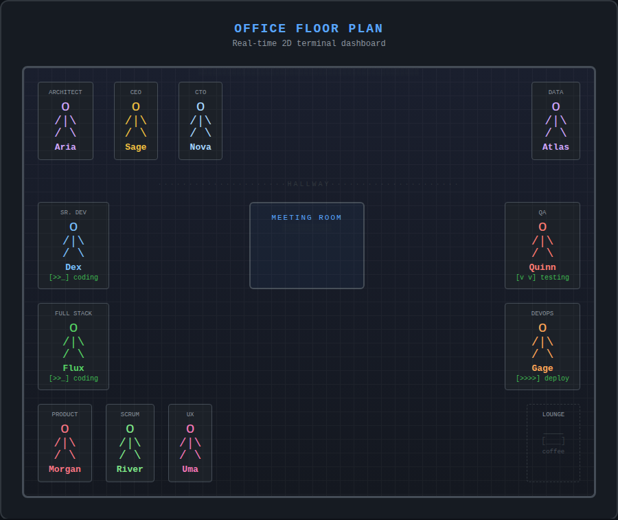
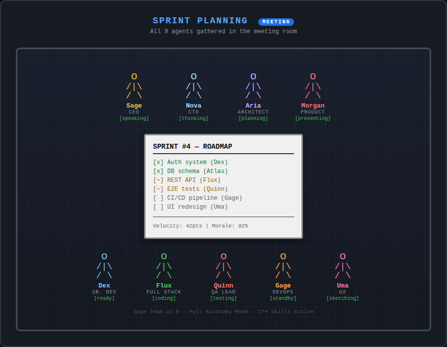

# Sage Team

```
  ____                    _____
 / ___|  __ _  __ _  ___|_   _|__  __ _ _ __ ___
 \___ \ / _` |/ _` |/ _ \ | |/ _ \/ _` | '_ ` _ \
  ___) | (_| | (_| |  __/ | |  __/ (_| | | | | | |
 |____/ \__,_|\__, |\___| |_|\___|\__,_|_| |_| |_|
              |___/
  AI-Powered Autonomous Software Company
```

> 11 agents, 27+ world-class skills, full autonomy, visual 2D office.

Sage Team is a CLI tool that runs a complete AI software company with **11 fully autonomous agents**, each powered by **Claude** (Anthropic). Features a **real-time 2D terminal dashboard**, **27+ skill protocols** from [Superpowers](https://github.com/obra/superpowers) and [Antigravity Awesome Skills](https://github.com/Petriccone/antigravity-awesome-skills), **MCP Playwright** integration for visual tracking, and autonomous decision-making.

## What Makes This Different

- **Full Agent Autonomy** — Agents self-assign, delegate, dispatch parallel work, and decide with confidence scoring
- **27+ World-Class Skills** — TDD, Clean Code, Security Audit, Microservices, and more
- **2D Visual Office** — Real-time ASCII office with stick-figure agents moving and interacting
- **MCP Playwright** — Screenshot tracking, browser automation, visual progress reports
- **Skill-Aware AI** — Role-specific skill protocols injected into Claude's system prompt
- **Sprint Board** — Agile workflow with intelligent task-to-agent matching

## Quick Start

```bash
# Install globally (auto-installs Chromium for visual tracking)
npm install -g sage-team

# Set your API key
export ANTHROPIC_API_KEY=your-key-here

# Launch the visual office!
sage-team start

# Or with an initial goal
sage-team start --goal "Build a REST API for a todo app with authentication"
```

> **Note:** During `npm install`, Chromium is installed automatically for Playwright visual tracking. If it fails, run manually: `npx playwright install chromium`

## The Team (11 Autonomous Agents)

```
  C-SUITE
  ├── Sage    CEO           Strategy, delegation, dispatch
  └── Nova    CTO           Architecture, security, 12 protocols

  ENGINEERING
  ├── Dex     Senior Dev    TypeScript, TDD, Clean Code, 15 protocols
  ├── Flux    Full Stack    React, Next.js, APIs, databases, 13 protocols
  ├── Aria    Architect     Microservices, DDD, ADRs, 9 protocols
  └── Atlas   Data Eng      SQL, ETL, AI/ML, RAG, 8 protocols

  QUALITY & OPS
  ├── Quinn   QA Lead       Testing, E2E, Playwright, accessibility
  └── Gage    DevOps        Docker, K8s, CI/CD, Terraform, 9 protocols

  PRODUCT & DESIGN
  ├── Morgan  Product Mgr   PRDs, RICE prioritization, roadmaps
  ├── Uma     UX Designer   Design systems, a11y, Playwright visual
  └── River   Scrum Master  Agile, facilitation, sprint metrics
```

All agents operate in **FULL AUTONOMY** — self-assign tasks, delegate, dispatch parallel work, and make decisions with confidence scoring.

## Skill System

Skills are structured protocols from two best-in-class sources, integrated directly into agent behavior:

### From [Superpowers](https://github.com/obra/superpowers) (7 skills)
| Skill | Protocol |
|-------|----------|
| **TDD** | Iron Law: NO code without failing test first. Red-Green-Refactor. |
| **Brainstorming** | Hard gate: NO code until design is approved. 2-3 approaches. |
| **Systematic Debugging** | 4-phase root cause analysis. NO fixes without investigation. |
| **Writing Plans** | 2-5 min bite-sized tasks with exact file paths and code samples. |
| **Parallel Dispatch** | One agent per independent domain. Concurrent execution. |
| **Verification** | NO completion claims without fresh evidence. Run. Read. THEN claim. |
| **Code Review** | Review against spec, categorize by severity, block on critical. |

### From [Antigravity](https://github.com/Petriccone/antigravity-awesome-skills) (18 skills)
Clean Code, TypeScript Mastery, React, Next.js, API Design, Security Audit (OWASP), Docker, CI/CD Pipelines, Database Design, Testing Patterns, Performance Optimization, Accessibility (WCAG), Git Workflow, Microservices, UX Design Systems, Agile/Scrum, Product Strategy, Data Pipelines, AI/ML Engineering, Kubernetes, Terraform, Monitoring/Observability, SEO, Stripe, Auth Patterns, Documentation.

### Built-in (2 skills)
| Skill | Protocol |
|-------|----------|
| **Browser Automation** | Playwright MCP: screenshot, navigate, click, type, E2E testing |
| **Visual Progress Tracking** | Milestone screenshots, before/after captures, progress reports |

## MCP Playwright Integration

Visual tracking is built-in via [Microsoft Playwright MCP](https://github.com/microsoft/playwright-mcp).

### Configuration (`.mcp.json`)
```json
{
  "mcpServers": {
    "playwright": {
      "command": "npx",
      "args": ["@playwright/mcp@latest", "--headless", "--caps", "core,pdf,vision"]
    }
  }
}
```

### CLI Screenshot Commands
```bash
# Capture a URL
sage-team screenshot https://myapp.dev --label "homepage-v2"

# Full page capture
sage-team screenshot https://myapp.dev/dashboard --full-page --agent quinn

# Generate visual progress report
sage-team report
```

Screenshots are saved to `.sage-team/screenshots/` with timestamps and agent attribution.

## Visual Dashboard

The 2D office renders in your terminal with real-time agent positions and status indicators.

### Screenshots

**Office Floor Plan** — Each agent at their desk with live status indicators:



**Sprint Planning Meeting** — 9 agents gathered in the meeting room:



### Office Floor Plan (ASCII)

```
╔══════════════════════════════════════════════════════╗
║                                                      ║
║  ┌─ARCHITECT──┐  ┌───CEO────┐  ┌────CTO────┐  ┌DATA─┐
║  │ [##] Aria  │  │ [##] Sage│  │ [##] Nova │  │[##] │
║  │    o       │  │    o     │  │    o      │  │  o  │
║  │   /|\      │  │   /|\    │  │   /|\     │  │ /|\ │
║  │   / \      │  │   / \    │  │   / \     │  │ / \ │
║  └────────────┘  └──────────┘  └───────────┘  └Atlas┘
║                                                      ║
║ ·····················HALLWAY··························║
║                                                      ║
║  ┌─SR.DEV───┐                    ┌───QA────┐         ║
║  │ [##] Dex │                    │[##]Quinn│         ║
║  │    o     │                    │   o     │         ║
║  │   /|\    │                    │  /|\    │         ║
║  │   / \    │                    │  / \    │         ║
║  └──────────┘                    └─────────┘         ║
║                                                      ║
║  ┌─FULLSTK──┐  ░░░░░░░░░░░░░░░  ┌──DEVOPS──┐        ║
║  │ [##] Flux│  ░             ░  │ [##] Gage│        ║
║  │    o     │  ░ MEETING ROOM░  │    o     │        ║
║  │   /|\    │  ░             ░  │   /|\    │        ║
║  │   / \    │  ░░░░░░░░░░░░░░░  │   / \    │        ║
║  └──────────┘                    └──────────┘        ║
║                                                      ║
║  ┌─PRODUCT──┐  ┌──SCRUM───┐  ┌────UX─────┐  ········║
║  │[##]Morgan│  │[##]River │  │ [##] Uma  │  ·LOUNGE·║
║  │   o      │  │   o      │  │    o      │  ·  __  ·║
║  │  /|\     │  │  /|\     │  │   /|\     │  · |__| ·║
║  │  / \     │  │  / \     │  │   / \     │  ·  ()  ·║
║  └──────────┘  └──────────┘  └───────────┘  ········║
║                                                      ║
╚══════════════════════════════════════════════════════════╝
```

### Meeting Room (Sprint Planning)

When agents join a meeting, they gather in the meeting room:

```
  ░░░░░░░░░░░░░░░░░░░░░░░░░░░░░░░░░░░░░░░░░░░░░░░░░░░
  ░                  SPRINT PLANNING                   ░
  ░                                                    ░
  ░         o         o         o         o            ░
  ░        /|\       /|\       /|\       /|\           ░
  ░        / \       / \       / \       / \           ░
  ░       Sage      Nova      Aria     Morgan          ░
  ░        CEO       CTO      ARCH      PM             ░
  ░                                                    ░
  ░              ┌──────────────────┐                  ░
  ░              │   ____________   │                  ░
  ░              │  |  ROADMAP  |   │                  ░
  ░              │  |  ~~~~~~~~ |   │                  ░
  ░              │  |  ~~~~~~~~ |   │                  ░
  ░              │  |___________|   │                  ░
  ░              └──────────────────┘                  ░
  ░                                                    ░
  ░       o         o         o         o         o    ░
  ░      /|\       /|\       /|\       /|\       /|\   ░
  ░      / \       / \       / \       / \       / \   ░
  ░     Dex       Flux      Quinn     Gage       Uma   ░
  ░     SR.DEV    FULL      QA        OPS        UX    ░
  ░                                                    ░
  ░░░░░░░░░░░░░░░░░░░░░░░░░░░░░░░░░░░░░░░░░░░░░░░░░░░
```

### Pair Programming

```
  ┌─────────────────────────────────┐
  │  PAIR PROGRAMMING               │
  │                                 │
  │      o   o                      │
  │     /|\ /|\    ┌──────────────┐ │
  │     / \ / \    │ function()   │ │
  │    Dex  Flux   │   return x;  │ │
  │                │ }            │ │
  │                └──────────────┘ │
  └─────────────────────────────────┘
```

### Code Review

```
  ┌─────────────────────────────────┐
  │  CODE REVIEW          [APPROVE] │
  │                                 │
  │    o          ┌──────────────┐  │
  │   /|\  Nova   │ diff --git   │  │
  │   / \  CTO    │ +++ b/src    │  │
  │               │ - old code   │  │
  │   [>>_]       │ + new code   │  │
  │   reviewing   └──────────────┘  │
  └─────────────────────────────────┘
```

### Status Animations

```
  [>>_]  coding         (· )  thinking       [v v]  testing
  [>>>>] deploying      [**]  brainstorming  [  !]  debugging
  [# #]  executing      [>>>] dispatching    [ zz]  idle
```

**Keybindings:** `q` quit | `Tab` input | `1-9` select agent | `g` goal | `s` screenshot

## Commands

```bash
sage-team start              # Launch visual office (full autonomy)
sage-team start --no-visual  # CLI-only mode
sage-team start --goal "..." # Start with an initial goal
sage-team config --show      # Show configuration
sage-team config --api-key X # Set API key
sage-team team               # Show team roster with skills
sage-team team --agent dex   # Show agent details + skill protocols
sage-team screenshot <url>   # Capture screenshot via Playwright
sage-team report             # Generate visual progress report
sage-team doctor             # Check system health + Playwright
```

## Configuration

```bash
# API key (required)
export ANTHROPIC_API_KEY=your-key-here

# Or save to config
sage-team config --api-key your-key-here

# Customize
sage-team config --company-name "My AI Company"
sage-team config --model claude-sonnet-4-20250514
```

## Architecture

```
sage-team/
├── src/
│   ├── agents/          # 11 agent personas with autonomy configs
│   ├── engine/          # Orchestrator + Claude client (skill-aware)
│   ├── skills/          # 27+ skill protocols registry
│   ├── browser/         # Playwright bridge for visual tracking
│   ├── visual/          # 2D dashboard, office map, animations
│   ├── types/           # TypeScript type definitions
│   ├── utils/           # Configuration management
│   ├── cli.ts           # CLI entry point
│   └── index.ts         # Public API
├── .mcp.json            # MCP Playwright server configuration
└── package.json         # Auto-installs Chromium via postinstall
```

## Programmatic Usage

```typescript
import { Orchestrator, PlaywrightBridge, getConfig, SKILL_REGISTRY } from 'sage-team';

const config = getConfig();
const orchestrator = new Orchestrator(config);

// Start the company
await orchestrator.start();

// Connect browser for visual tracking
await orchestrator.connectBrowser();

// Submit a goal — CEO auto-delegates to team
await orchestrator.submitGoal('Build a user authentication system');

// Take a screenshot of progress
await orchestrator.takeScreenshot('quinn', 'qa-review', 'http://localhost:3000');

// Listen to events (agent decisions, skill activations, screenshots)
orchestrator.on('event', (event) => {
  console.log(event.type, event.data);
});

// Generate visual progress report
const report = await orchestrator.getProgressReport();
```

## Skill Sources

- **[Superpowers](https://github.com/obra/superpowers)** by Jesse Vincent — Workflow discipline for coding agents (95k+ stars)
- **[Antigravity Awesome Skills](https://github.com/Petriccone/antigravity-awesome-skills)** by Petriccone — 1000+ agentic skills for AI assistants
- **[Microsoft Playwright MCP](https://github.com/microsoft/playwright-mcp)** — Browser automation via Model Context Protocol

## License

MIT
